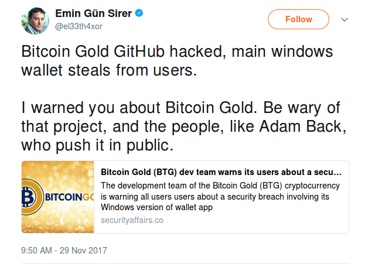

# Emin Gün Sirer Lying About Things

Work in progress; pull-req's welcome! Best to keep this to the strictest
possible definition, e.g. clear lies (including lying by omission), not simply
ill-advised opinions.  So him claiming Bitcoin will crash due to selfish mining
is an opinion. Don't forget to archive any relevant websites with the [Internet
Archive Wayback Machine](https://web.archive.org) and [archive.is](https://archive.is).

Hopefully this will result in retractions and/or rebuttals and this repo will
stay empty, but we'll see...

# Claiming that Adam Back Pushed Bitcoin Gold

https://twitter.com/el33th4xor/status/935928919391440896

Status: No evidence provided that Adam did in fact do this.

# Unsubtantiated Sock Puppet Claims

https://twitter.com/el33th4xor/status/941909627008094208

Status: Zero evidence provided that any of the people he blocked are sock puppets, or are hired by any company.

# Teechan Scaling Claims

TODO! Quite a bit of work to document and explan this one...
